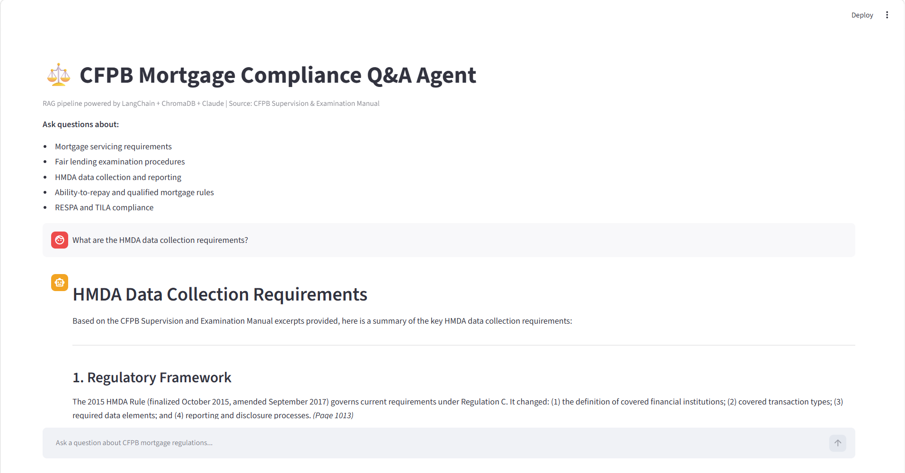
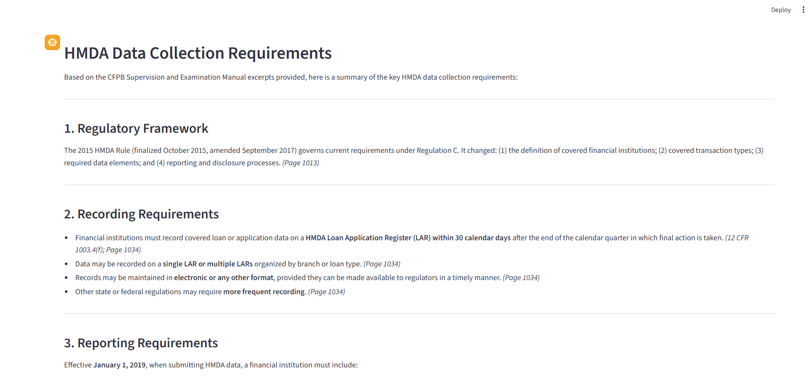
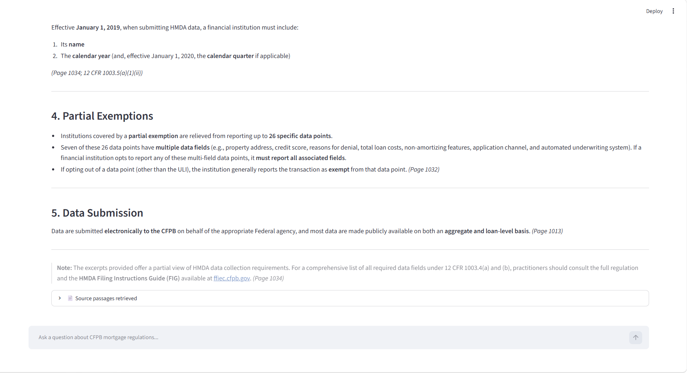

# CFPB Mortgage Compliance Legal Q&A Agent

A Retrieval-Augmented Generation (RAG) pipeline that lets users query the CFPB Supervision and Examination Manual using natural language. Built with LangChain, ChromaDB, the Anthropic Claude API, and Streamlit.

---

## What It Does

Ask plain-language questions about CFPB mortgage regulations and get grounded, cited answers pulled directly from the source manual — not hallucinated responses.

**Example questions:**
- *"What are the HMDA data collection requirements?"*
- *"How does the CFPB examine fair lending practices?"*
- *"What is the ability-to-repay rule?"*
- *"What are the requirements for mortgage servicing?"*

Each answer includes the source passages retrieved from the manual so you can verify every response.

---

## Architecture

```
User Query
    ↓
Sentence Transformer (all-MiniLM-L6-v2)
    ↓
Query Embedding
    ↓
ChromaDB Vector Store → Cosine Similarity Search
    ↓
Top 5 Most Relevant Chunks Retrieved
    ↓
Claude API (claude-sonnet-4-6) + Context
    ↓
Grounded Answer with Source Citations
    ↓
Streamlit Chat Interface
```

---

## Tech Stack

| Component | Tool |
|---|---|
| LLM | Anthropic Claude API (claude-sonnet-4-6) |
| Embeddings | HuggingFace sentence-transformers (all-MiniLM-L6-v2) |
| Vector Store | ChromaDB |
| RAG Framework | LangChain |
| Document Loader | PyPDFLoader |
| Text Splitting | RecursiveCharacterTextSplitter (1000 char chunks, 200 overlap) |
| Frontend | Streamlit |

---

## Screenshots




---

## How to Run

### Prerequisites
- Python 3.11
- Anthropic API key (get one free at console.anthropic.com)
- CFPB Supervision and Examination Manual PDF

### Setup

```bash
# Clone the repo
git clone https://github.com/ahartshorn416/legal-qa-agent
cd legal-qa-agent

# Create conda environment
conda create -n legal-qa python=3.11 -y
conda activate legal-qa

# Install dependencies
pip install anthropic langchain langchain-anthropic langchain-community \
    chromadb streamlit sentence-transformers python-dotenv \
    langchain-text-splitters pypdf
```

### Add your API key

Create a `.env` file in the project root:

```
ANTHROPIC_API_KEY=your_key_here
```

### Download the source document

Download the CFPB Supervision and Examination Manual:
```
https://files.consumerfinance.gov/f/documents/cfpb_supervision-and-examination-manual.pdf
```

Save it to the `docs/` folder.

### Ingest the document

```bash
python ingest.py
```

This loads the PDF, splits it into chunks, generates embeddings, and saves the vector store to `chroma_db/`. Takes 3–5 minutes on first run.

### Run the app

```bash
streamlit run app.py
```

Open **http://localhost:8501** in your browser.

---

## Project Structure

```
legal-qa-agent/
├── app.py              # Streamlit chat interface + Claude API integration
├── ingest.py           # Document loading, chunking, and vector store creation
├── docs/               # Place CFPB PDF here (not committed - too large)
├── chroma_db/          # Vector store (auto-generated by ingest.py)
├── screenshots/        # App screenshots for README
├── .env                # API key (not committed)
├── .gitignore
└── README.md
```

---

## Design Decisions

**Chunk size: 1000 characters with 200 overlap**
The 200 character overlap preserves context across chunk boundaries — sentences that span two chunks don't lose meaning on either side.

**Top 5 chunks retrieved**
Balances providing enough context for accurate answers without overwhelming the prompt with irrelevant passages.

**System prompt scoped to source material**
Claude is instructed to answer strictly from retrieved context and explicitly say so when the answer isn't in the manual — preventing hallucination on regulatory questions where accuracy is critical.

**Source passages expander**
Every answer shows the exact chunks retrieved so users can verify responses against the original manual — essential for compliance use cases.

---

## Related Project

This agent is built to complement the [HMDA Loan Approval ML project](https://github.com/ahartshorn416/hmda-loan-approval), which analyzes 4.25M real HMDA 2023 mortgage records. Together they demonstrate both the analytical (ML modeling) and operational (RAG-based Q&A) sides of working with mortgage regulatory data.

---

## Author

Alison Hartshorn — [GitHub](https://github.com/ahartshorn416) | [LinkedIn](https://linkedin.com/in/alison-hartshorn)
